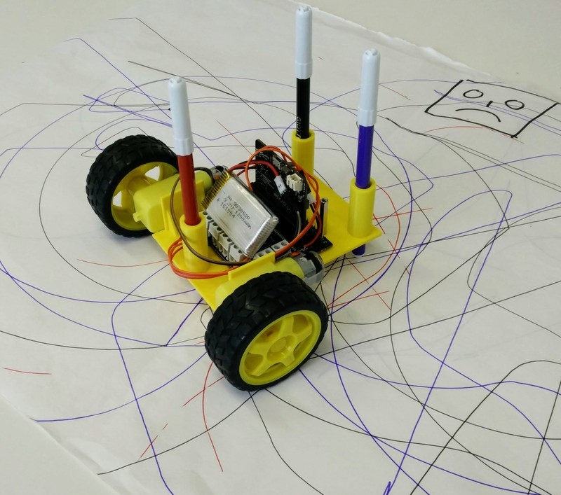
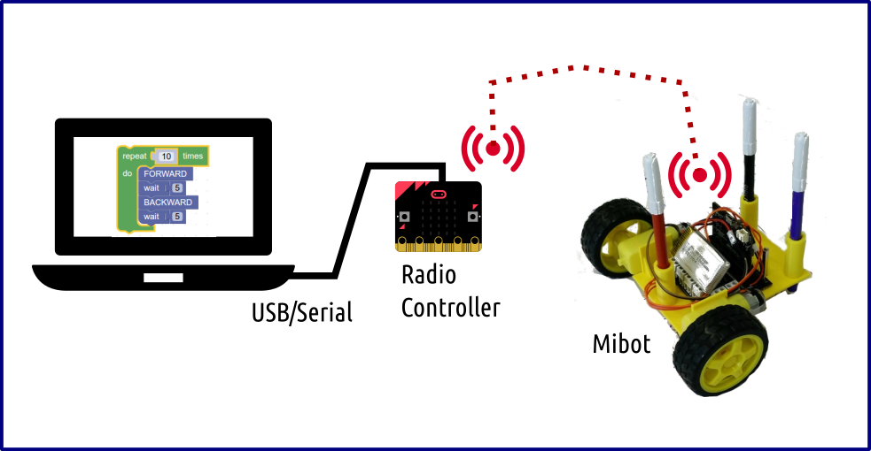

# Mibot blockly

## INTRODUCTION

this project aim to develop a simplified visual programming language devoted to **Mibot** , a DIY robot based on micro:bit.



The scope of Mibot Blocly is to create semplified blocks of code for controlling the robot movement, avoiding to manage the control of single pins to start and stop the motors.

The coding environment is based on **Nodejs** and **blockly**

## ARCHITECTURE


The Mibot robot is based on microbit card. In this scenario we have the following elements:

- Mibot Blocly running on PC
- a micro:bit running as Radio Controller  
- Mibot rover based on micro:bit




The commands from Mibot Blocky go through serial port to the Radio Controller. Here, an onsite program transfers the command  to the Mibot robot using the internal  radio network
Finally, the Mibot acts on their motors depending on the command received.

_Plese note:_

Both on rover and on robot must be run specific programs that manages radio trasmissions and the motors actions

Clone this repository:

```
git clone https://github.com/darkwave/blockly-boilerplate
```

Install dependencies and download updated version of [blockly](https://github.com/google/blockly) javascript files:

```
npm install
```

Run your favorite web server in the main directory. For example you may use:

```
http-server
```

Now you can start customizing your blocks and behaviors editing the following files:

* myBlocksInit.js
* myBlocks.js
* myInterpreter.js
* toolbox.xml

Enjoy your new blockly based project!
